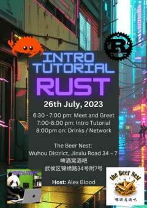

# Rust Introduction Tutorial

Welcome to the Rust Introduction Tutorial! This workshop is designed for those who are new to Rust, and it will walk you through the basics of using and understanding the language.

## About Rust

Rust is a modern system programming language focused on performance, safety, and concurrency. It accomplishes these goals by having a number of compile-time safety checks with no runtime overhead, while eliminating common bugs such as null pointer dereferencing, double free, dangling pointers, etc.

## Pre-requisites

To get the most out of this tutorial, you should have a basic understanding of programming concepts. Experience with a systems programming language like C or C++ can be helpful, but it's not a requirement.

You'll need the following software installed:

1. [Rust](https://www.rust-lang.org/tools/install)
2. An editor like [VS Code](https://code.visualstudio.com/download) (recommended with the [Rust-Analyzer](https://marketplace.visualstudio.com/items?itemName=rust-lang.rust-analyzer) extension)

## Installing Rust

Follow the instructions for your OS below. Refer to [Rust](https://www.rust-lang.org/tools/install) if you get stuck.

### Windows 

1. To install Rust, download and run, then follow the onscreen instructions.

[Windows Installer](https://static.rust-lang.org/rustup/dist/i686-pc-windows-gnu/rustup-init.exe)

2. After installation, you may need to close and reopen your command prompt or terminal.

3. Verify the installation by typing the following command:

`
rustc --version
`
`
cargo --version
`

This should show the installed version of Rust.

### MacOS

1. Open Terminal.

2. Download and install rustup by running the following command and following on-screen instructions:

`
curl --proto '=https' --tlsv1.2 -sSf https://sh.rustup.rs | sh
`

3. Close the terminal window and reopen a new one.

4. Verify the installation with:

`
rustc --version
`
`
cargo --version
`

This should output the version of Rust that was installed.

## What You'll Learn

In this tutorial, you'll learn the basics of Rust, including:

- Variables and Data Types
- Control Flow
- Error Handling
- Ownership and Borrowing
- Structs, Enums, and Pattern Matching
- Modules, Packages, and Crates

### What We Won't Cover
To try to apply to a broader audience we won't cover:

- Concurrency
- Cross Compilation
- Networking
- Creating a library
- Much more covered in the [rust book](https://doc.rust-lang.org/book/)

## Running the Code

This project is a standard Cargo project. You can run the project with `cargo run`, test it with `cargo test`, and build it with `cargo build`.

## Contributing

Pull requests are welcome. For major changes, please open an issue first to discuss what you would like to change.

## License

[MIT](https://choosealicense.com/licenses/mit/)

## References and Learning

[Project Reference Resources](../main/REFERENCES.md)
