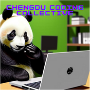

# Chengdu Rust Meetup

Welcome to the Chengdu Coding Collective Rust Meetup Group!

## About Rust

Rust is a modern system programming language focused on performance, safety, and concurrency. It accomplishes these goals by having a number of compile-time safety checks with no runtime overhead, while eliminating common bugs such as null pointer dereferencing, double free, dangling pointers, etc.

## Running the Code
1) Navigate to the project you wish to run
2) Ensure Rust and Cargo are installed and run:
   `cargo run`

## Contributing

Pull requests are welcome. For major changes, please open an issue first to discuss what you would like to change.

## License

[MIT](https://choosealicense.com/licenses/mit/)

## References and Learning

[Project Reference Resources](../main/REFERENCES.md)
