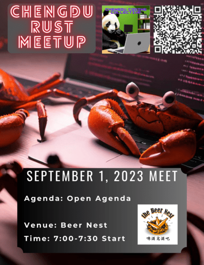

# Chengdu Rust Meeting 2

Welcome to The Chengdu Coding Collective's Second Monthly Rust meetup! This month we have an open agenda and are talking about all things rust, chengdu development, and more!

## About Rust

Rust is a modern system programming language focused on performance, safety, and concurrency. It accomplishes these goals by having a number of compile-time safety checks with no runtime overhead, while eliminating common bugs such as null pointer dereferencing, double free, dangling pointers, etc.

## Post Meeting Notes

### Points Discussed
- Rust vs Typescript and Python for web scraping
- Rust application and syntax 
- Rust vs C++ (briefly) 
